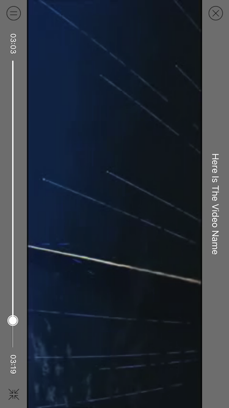

**SRVideoPlayer** is a video player based on AVFoundation. Custom play interface providing play, pause, full screen button and play progress, load progress bar. Cache video data while playing, next time play directly with cached data, do not have to download again.

## Features

* [x] Automatically distinguish local and network video.
* [x] Support to slide left half of the screen up or down to adjust brightness.
* [x] Support to slide right half of the screen up or down to adjust sound.
* [x] Support to slide the screen left or right to seek play progress.

## Screenshots

 

 

## Installation

**CocoaPods**
> Add **pod 'SRVideoPlayer'** to the Podfile, then run **pod install** in the terminal.

**Manual**
> Drag the **SRVideoPlayer** folder to the project.(Note: If the project has already import Masonry, you should remove it which in the SRVideoPlayer folder.)

## Usage

````objc
/**
 Creates and returns a video player with video's URL, playerView and playerSuperView.

 @param videoURL        The URL of the video.
 @param playerView      The view which you want to display the video.
 @param playerSuperView The playerView's super view.
 @return A newly video player.
 */
+ (instancetype)playerWithVideoURL:(NSURL *)videoURL playerView:(UIView *)playerView playerSuperView:(UIView *)playerSuperView;
````

````objc
UIView *playerView = [[UIView alloc] initWithFrame:CGRectMake(0, 0, self.view.frame.size.width, self.view.frame.size.width)];
playerView.center = self.view.center;
[self.view addSubview:playerView];
_videoPlayer = [SRVideoPlayer playerWithVideoURL:_videoURL playerView:playerView playerSuperView:playerView.superview];
_videoPlayer.videoName = @"Here Is The Video Name";
_videoPlayer.playerEndAction = SRVideoPlayerEndActionStop;
[_videoPlayer play];
````

## Custom

````objc
/**
 The action when the video play to end, default is SRVideoPlayerEndActionStop.
 */
@property (nonatomic, assign) SRVideoPlayerEndAction playerEndAction;

/**
 The name of the video which will be displayed at the top.
 */
@property (nonatomic, copy) NSString *videoName;
````

## Significant Update

### 2017.04.06
Cache video data while playing, next time play directly with local data, do not have to download again.  
But the current cache mode is not perfect, next I will optimize it.