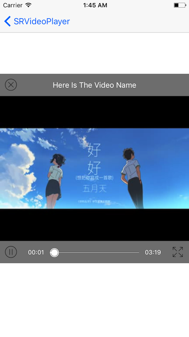

# SRVideoPlayer

## Features

* [x] Support local and network video and automatically distinguish.
* [x] Custom play interface providing play、pause、full screen button and play progress、load progress bar.
* [x] Slide left or right half of the screen up or down to adjust brightness or sound.
* [x] Slide the screen left or right to seek play progress.
* [x] Cache video data while playing, next time play directly with local data, do not have to download again.

## Screenshots

   
  
***

 

## Installation

### CocoaPods
> Add **pod 'SRVideoPlayer'** to the Podfile, then run **pod install** in the terminal.

### Manual
> Drag the **SRVideoPlayer** folder to the project.(Note: If the project has already import Masonry, you should remove it which in the SRVideoPlayer folder.)

## APIs

````objc
/**
 Create a SRVideoPlayer object with video's URL.

 @param videoURL        The URL of the video.
 @param playerView      The view which you want to display the video.
 @param playerSuperView PlayerView's super view.
 @return A SRVideoPlayer object
 */
+ (instancetype)playerWithVideoURL:(NSURL *)videoURL playerView:(UIView *)playerView playerSuperView:(UIView *)playerSuperView;

- (void)play;

- (void)pause;

- (void)resume;

- (void)destroyPlayer;
````

## Usage

````objc
UIView *playerView = [[UIView alloc] initWithFrame:CGRectMake(0, 0, self.view.frame.size.width, self.view.frame.size.width)];
playerView.center = self.view.center;
[self.view addSubview:playerView];
_videoPlayer = [SRVideoPlayer playerWithVideoURL:_videoURL playerView:playerView playerSuperView:playerView.superview];
_videoPlayer.videoName = @"Here Is The Video Name";
_videoPlayer.playerEndAction = SRVideoPlayerEndActionStop;
[_videoPlayer play];
````

## Custom

````objc
/**
 Action when video play to end, default is SRVideoPlayerEndActionStop.
 */
@property (nonatomic, assign) SRVideoPlayerEndAction playerEndAction;

/**
 Name of the video which will play.
 */
@property (nonatomic, copy) NSString *videoName;
````

## Significant Update

### 2017.04.06
Cache video data while playing, next time play directly with local data, do not have to download again.  
But the current cache mode is not perfect, next I will optimize it.