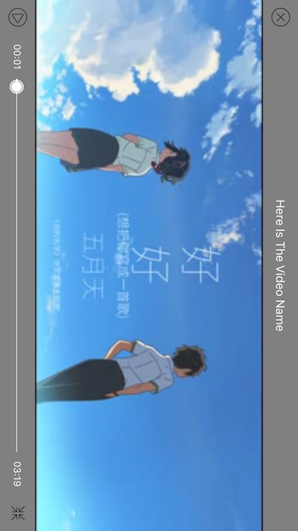
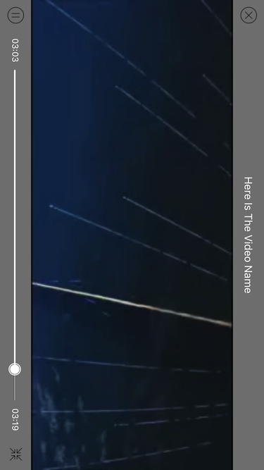

# SRVideoPlayer

## Features

* Support local and network video and automatically distinguish.
* Custom play interface. providing play, pause, full-screen and other functions. providing play progress bar, load progress bar etc.
* Slide left of the screen up or down to adjust the brightness. Slide right of the screen up or down to adjust the sound.
* Slide the screen left or right to adjust the play progress.
* Cache video data while playing, next time play directly with local data, do not have to download again.

***

* 支持本地和网络视频并且自动区分.
* 自定义播放界面, 提供播放 暂停 全屏 快进 快退等功能.
* 上下滑动屏幕左边调整亮度, 上下滑动屏幕右边调整音量.
* 左右滑动屏幕控制播放进度.
* 播放的同时缓存视频, 下次直接使用本地数据, 不必再次下载.

## Show

   
  
***

 

## Installation

### CocoaPods
> Add **pod 'SRVideoPlayer'** to the Podfile, then run **pod install** in the terminal.

### Manual
> Drag the **SRVideoPlayer** folder to the project.(Note: if the project has already import Masonry, you should remove it which in the SRVideoPlayer folder)

## APIs

````objc
/**
 Create a SRVideoPlayer object with videoURL, playerView and playerSuperView.

 @param videoURL        The URL of the video.
 @param playerView      The view which you want to display the video.
 @param playerSuperView PlayerView's super view.
 @return                A SRVideoPlayer object
 */
+ (instancetype)playerWithVideoURL:(NSURL *)videoURL playerView:(UIView *)playerView playerSuperView:(UIView *)playerSuperView;

- (void)play;

- (void)pause;

- (void)resume;

- (void)destroyPlayer;

/**
 Cancel the current download video action, you can call this method when destroy the video player.
 */
- (void)cancelDownloadAction;

/**
 Clear all cached videos.
 */
- (void)clearCachedVideos;

````

## Usage

````objc
UIView *playerView = [[UIView alloc] initWithFrame:CGRectMake(0, 0, self.view.frame.size.width, self.view.frame.size.width)];
playerView.center = self.view.center;
[self.view addSubview:playerView];
_videoPlayer = [SRVideoPlayer playerWithVideoURL:_videoURL playerView:playerView playerSuperView:playerView.superview];
_videoPlayer.videoName = @"Here Is The Video Name";
_videoPlayer.playerEndAction = SRVideoPlayerEndActionStop;
[_videoPlayer play];

````

## Custom Settings

````objc
/** 
 Action when video play to end, default is SRVideoPlayerEndActionStop. 
 */
@property (nonatomic, assign) SRVideoPlayerEndAction playerEndAction;

/** 
 The name of the video which will play. 
 */
@property (nonatomic, copy) NSString *videoName;

````

## Significant updates

### 2017.04.06
> Cache video data while playing, next time play directly with local data, do not have to download again.

> **If you have any question, submit an issue or contact me.**   
> **QQ: 1990991510**   
> **Email: guowilling@qq.com**   
> **If this repo helps you, please give it a star.**   
> **Have Fun.**