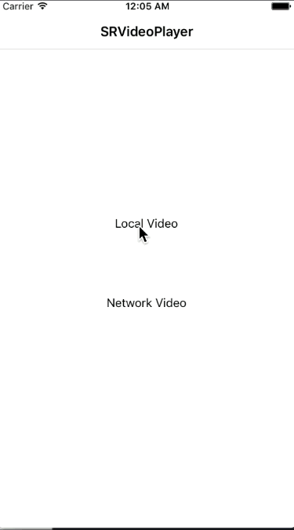
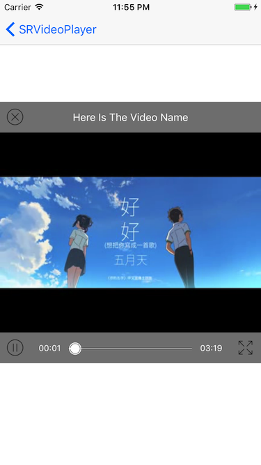

# SRVideoPlayer

## Features

* Custom play interface. providing play, pause, full-screen and other functions. providing play progress bar, load progress bar etc.
* Slide left of the screen up or down to adjust the brightness. Slide right of the screen up or down to adjust the sound.
* Slide the screen left or right to adjust the play progress.

***

* 自定义播放界面, 提供播放 暂停 暂停 快进 快退等功能.
* 上下滑动屏幕左边调整亮度, 上下滑动屏幕右边调整音量.
* 左右滑动屏幕控制播放进度.

## Show pictures

 

## Usage

````objc
/**
 Create a SRVideoPlayer object with videoURL, playerView and playerSuperView.

 @param videoURL        The URL of the video.
 @param playerView      The view which you want to display the video.
 @param playerSuperView PlayerView's super view.
 @return                A SRVideoPlayer object
 */
+ (instancetype)playerWithVideoURL:(NSURL *)videoURL playerView:(UIView *)playerView playerSuperView:(UIView *)playerSuperView;

UIView *playerView = [[UIView alloc] initWithFrame:CGRectMake(0, 0, self.view.frame.size.width, self.view.frame.size.width)];
playerView.center = self.view.center;
[self.view addSubview:playerView];
_videoPlayer = [SRVideoPlayer playerWithVideoURL:_videoURL playerView:playerView playerSuperView:playerView.superview];
_videoPlayer.videoName = @"Here Is The Video Name";
_videoPlayer.playerEndAction = SRVideoPlayerEndActionStop;
[_videoPlayer play];

````

## Custom Settings

````objc
/** Action when video play to end, default is SRVideoPlayerEndActionStop. */
@property (nonatomic, assign) SRVideoPlayerEndAction playerEndAction;

/** The name of the video which will play. */
@property (nonatomic, copy) NSString *videoName;
````

## Next

> Cache video data while downloading, next time play directly with local data, do not have to download again.   
> 边下边缓存功能, 下一次播放的时候, 直接使用缓存数据不用再次下载.

**If you have any question, please issue or contact me.**   
**If this repo helps you, please give it a star, thanks a lot.**  
**Have Fun.**