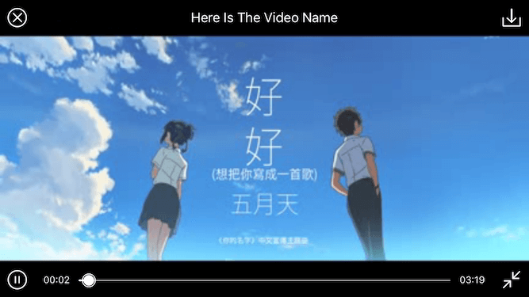

# SRVideoPlayer

Custom interface video player which has various interactive gestures.



## Features

* [x] Support to tap and drag bottom slider seek play progress.
* [x] Support to slide left half of the screen up or down to adjust brightness.
* [x] Support to slide right half of the screen up or down to adjust sound.
* [x] Support to slide the screen left or right to seek play progress.
* [x] Support to download network video so next time play directly with cached data.

## Installation

**CocoaPods**
> Add **pod 'SRVideoPlayer'** to the Podfile, then run **pod install** in the terminal.

**Manual**
> Drag the **SRVideoPlayer** folder to the project.(Note: If the project has already import Masonry, you should remove it which in the SRVideoPlayer folder.)

## APIs

````objc
/**
 Creates and returns a video player with video's URL, playerView and playerSuperView.

 @param videoURL        The URL of the video.
 @param playerView      The view which you want to display the video.
 @param playerSuperView The playerView's super view.
 @return A newly video player.
 */
+ (instancetype)playerWithVideoURL:(NSURL *)videoURL playerView:(UIView *)playerView playerSuperView:(UIView *)playerSuperView;

- (void)play;
- (void)pause;
- (void)resume;

- (void)destroyPlayer;
````

## Usage

````objc
UIView *playerView = [[UIView alloc] initWithFrame:CGRectMake(0, 0, self.view.frame.size.width, self.view.frame.size.width)];
playerView.center = self.view.center;
[self.view addSubview:playerView];
_videoPlayer = [SRVideoPlayer playerWithVideoURL:_videoURL playerView:playerView playerSuperView:playerView.superview];
_videoPlayer.videoName = @"Here Is The Video Name";
_videoPlayer.playerEndAction = SRVideoPlayerEndActionLoop;
[_videoPlayer play];
````

## Custom

````objc
/**
 The action when the video play to end, default is SRVideoPlayerEndActionStop.
 */
@property (nonatomic, assign) SRVideoPlayerEndAction playerEndAction;

/**
 The name of the video which will be displayed in the top center.
 */
@property (nonatomic, copy) NSString *videoName;
````

## Contacts

Submit an issue or email me if you have any questions. <guowilling90@gmail.com>